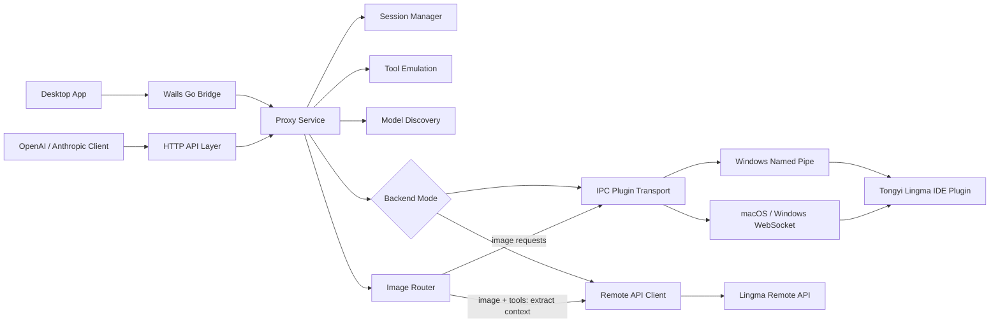

# Lingma Proxy

[English](./README.md) | [简体中文](./README.zh-CN.md) | [📘 使用教程 USAGE.md](./USAGE.md)

Lingma Proxy exposes Tongyi Lingma / QoderCN as standard **OpenAI-compatible** and **Anthropic-compatible** HTTP APIs. It can use either the recommended Remote API backend or the local IDE IPC channel, and ships as a CLI proxy service for macOS, Windows, and Linux, plus a desktop app for macOS, Windows, and Linux.

The project is designed for tools such as Claude Code, Hermes, CodeBuddy, Codex CLI, OpenCode, custom agents, and any client that can talk to OpenAI or Anthropic style APIs.

> **New here?** Start with **[USAGE.md](./USAGE.md)** — a step-by-step tutorial covering install, client setup for Claude Code / Codex CLI / CodeBuddy / Hermes / any OpenAI- or Anthropic-compatible client, the full endpoint and configuration reference, tool calling, image input, and a troubleshooting table. This README is the reference manual: architecture, capability matrix, model metadata, and release flow.

## Model Availability Disclaimer

Model availability is not the same for every Lingma user.

- The screenshots, recommendations, and examples in this repository reflect the maintainer's current enterprise Lingma environment.
- That does **not** mean personal accounts, other business accounts, or other enterprise tenants will see the same catalog.
- Actual model availability depends on the Lingma account type, enterprise tenant, remote API domain, region, product plan, and server-side entitlements.
- Lingma Proxy does not normally invent these models and does not silently remove them from `/v1/models`; the list primarily reflects what the active Lingma backend actually returns.

The proxy now supports three backend modes:

- **Remote API mode (default, recommended)**: imports the local Lingma / QoderCN login cache or an explicit credential file and calls the remote APIs directly. This behaves closest to a normal hosted API, avoids IDE/plugin session and environment limits, and is currently the best mode for Claude Code / Hermes style agents.
- **Qoder client mode**: when the legacy Remote API login cache is no longer present, the proxy automatically drives the signed-in Qoder desktop app's bundled CLI as a subprocess instead. It reuses the app's own login state (device token → job token) and inherits request signing from the client, so no credential file or gateway domain is configured. Model IDs come from the account (`Auto`, `Qwen3.8-Max`, `Kimi-K3`, …) and image input is not supported on this path yet. Set `--backend qodercli` to force it. On this path the client's own system text is forwarded to the CLI's system slot (`--append-system-prompt`), because the Qoder CN gateway reroutes user turns that name another product's identity. The thinking tier follows whatever the client asks for (`reasoning_effort`, `reasoning.effort`, `thinking.effort`, `output_config.effort`), and falls back to `thinking.budget_tokens` when no tier is named. The CLI parses `none|low|medium|high|xhigh|max` (thinking budgets 0/1024/8192/24576/49152/65536), but each model applies only part of that ladder — Qwen3.8 offers off/low/medium/xhigh while GLM-5.3, Kimi-K3 and DeepSeek-Flash offer off/low/high/max — so the proxy resolves the requested tier against the model's own ladder instead of guessing. A client's "off" is forwarded as `none`; omitting the tier is not the same as turning thinking off. Clients with no tier selector at all can bake one into the model ID (`Qwen3.8-Flash-xhigh`, `Qwen3.8-Flash-极高`); a suffixed ID outranks the request body, so register one entry per tier to turn that client's model picker into a tier picker.
  Both Qoder deployments are served at once when both are installed and signed in: the CN app (default, unmarked IDs) and the international app behind an `intl/` ID prefix, because the two catalogs share names such as `Qwen3.8-Flash`. International model IDs therefore look like `intl/Qwen3.8-Flash`, `intl/Kimi-K3`, `intl/MiniMax-M3`; the prefix is recognised in any path segment, so a client that namespaces IDs still routes correctly (`lingma-proxy/intl/Qwen3.8-Flash`). `global/`, `国际/` and `国际版/` are accepted as aliases on input. The two sites mint job tokens from their own gateways (`openapi.qoder.com.cn` and `openapi.qoder.sh`) under the same OAuth client id, so no extra configuration is needed beyond a signed-in desktop app. The international CLI is launched with a private `--config-dir` because sharing `~/.qoder` with the desktop app makes it answer every request with `token is not active`. Thinking tiers are passed through to the international CLI unclamped, since the measured ladder above is the CN catalog's. Set `LINGMA_QODERCLI_SITES=cn` to serve only the CN site (or `global` for only the international one); a site with no signed-in desktop app is skipped without affecting the other. With a single site enabled the prefix disappears and the list is exactly what that CLI reports, so `LINGMA_QODERCLI_SITES=global` plus `--port 8096` gives a standalone international-only proxy beside the CN one.
- **IPC mode**: connects to the local Lingma / QoderCN runtime over WebSocket / Named Pipe. This keeps behavior closest to the local IDE runtime, but it can inherit IDE session lifetime, local runtime state, and environment constraints, so it is mainly a compatibility fallback.

## Runtime Compatibility

The current macOS validation status is:

For the complete Chat / Responses / Anthropic Messages experience, keep either the QoderCN desktop app or a supported Tongyi Lingma desktop / legacy Lingma runtime running. The VS Code extension `alibaba-cloud.tongyi-lingma` alone is not enough for full IPC generation because it does not expose the `session/new` RPC used by this proxy.

| Runtime | Remote API | IPC WebSocket / Pipe | Status |
| --- | --- | --- | --- |
| QoderCN desktop app only | verified | verified on macOS WebSocket | Full OpenAI / Anthropic endpoint matrix passed. |
| QoderCN desktop app + `alibaba-cloud.tongyi-lingma` VS Code extension | verified | verified; auto-detection prefers QoderCN | Full endpoint matrix passed. |
| JetBrains Tongyi Lingma plugin in IntelliJ IDEA | verified | verified on macOS WebSocket | Uses `~/.lingma`; model list, Chat Completions, Responses, and Anthropic Messages passed. |
| Tongyi Lingma desktop app / legacy Lingma runtime | supported as fallback | supported as fallback | Kept for existing users. |
| `alibaba-cloud.tongyi-lingma` VS Code extension only | remote cache may work | partial only | Model discovery works, but this extension runtime does not support the `session/new` RPC used for full Chat/Responses/Messages generation. |
| Windows QoderCN | expected | not yet verified on a Windows machine | Named Pipe compatibility still needs Windows real-machine or VM validation. |

Auto-detection prefers QoderCN runtime files first, then falls back to Lingma runtime files. In a local coexistence test, QoderCN exposed `37109`, the VS Code Lingma extension exposed `36510`, and the proxy selected QoderCN.

## Runtime Requirements and Reasoning Boundaries

- For Claude Code, Codex CLI, Hermes Agent, CodeBuddy, and similar clients, the proxy process must stay running while requests are in flight. If the desktop app or CLI proxy is manually quit during a streaming response, the current request must be retried by the client.
- **Remote API mode** only forwards the reasoning / thinking intent. The model may still perform internal reasoning, but the current upstream remote Lingma SSE does not expose a separate structured thinking / reasoning block, so the proxy cannot forward one and does not fabricate one.
- **IPC plugin mode** can forward Lingma IDE's native independent thinking stream when the client requests reasoning and the upstream IPC session actually emits thought chunks. In local real-client validation, both Hermes CLI and Claude Code displayed separate reasoning / thinking output over IPC once the proxy correctly treated Claude's `thinking.type=adaptive` as an enabled reasoning request.

## Current Version

<!-- VERSION:CURRENT:BEGIN -->
Current desktop app version: `v1.6.12`.

The canonical source is [VERSION](./VERSION). Run `./scripts/sync-version.sh` to propagate it into [desktop/wails.json](./desktop/wails.json), the desktop UI, and release-facing docs.
<!-- VERSION:CURRENT:END -->

See [CHANGELOG.md](./CHANGELOG.md) for release history.

Release builds are produced by GitHub Actions for:

| Asset | Platform | Purpose |
| --- | --- | --- |
| `lingma-proxy_<tag>_darwin_arm64.tar.gz` | macOS | CLI proxy |
| `lingma-proxy_<tag>_windows_amd64.zip` | Windows | CLI proxy |
| `lingma-proxy_<tag>_linux_amd64.tar.gz` | Linux x64 | CLI proxy |
| `lingma-proxy_<tag>_linux_arm64.tar.gz` | Linux arm64 | CLI proxy |
| `lingma-proxy-desktop_<tag>_darwin_arm64.dmg` | macOS Apple Silicon | Drag-to-install desktop app |
| `lingma-proxy-desktop_<tag>_darwin_arm64.zip` | macOS Apple Silicon | Raw `.app` archive |
| `lingma-proxy-desktop_<tag>_windows_amd64.zip` | Windows | Desktop app |
| `lingma-proxy-desktop_<tag>_linux_amd64.deb` | Linux x64 | Debian / Ubuntu desktop app |
| `lingma-proxy-desktop_<tag>_linux_amd64.rpm` | Linux x64 | Fedora / RHEL desktop app |
| `lingma-proxy-desktop_<tag>_linux_arm64.deb` | Linux arm64 | Debian / Ubuntu desktop app |
| `lingma-proxy-desktop_<tag>_linux_arm64.rpm` | Linux arm64 | Fedora / RHEL desktop app |
| `lingma-proxy_<tag>_sha256.txt` | all | Checksums |

### Feishu Bridge Preview Builds

Feishu Bridge features live on the `feat/feishu-bridge-go` branch and are not included in the normal `main` release assets.

Current preview focus:

- Feishu/Lark bot messages are routed into Lingma Proxy, so the same Lingma-backed model can answer from a Feishu chat.
- The bot can call `lark-cli` based tools for Feishu-side work such as messages, docs, calendars, knowledge bases, and related workspace operations, depending on the credentials and permissions configured locally.
- Replies use Feishu CardKit-style streaming updates where available, so long answers can appear progressively instead of waiting for the whole generation to finish.
- Local file access is permission-scoped. The app workspace is available by default, and extra read/write/delete paths are configured explicitly in the Feishu Agent advanced settings.
- Reminder-style scheduled tasks can be delivered directly through the Feishu channel at the due time, while agent-style scheduled tasks can still run through the model when that behavior is needed.
- Conversation context, tool results, imported skills, and optional MCP tools are managed on the Feishu Agent side to support longer work sessions.

If you want to try or inspect the Feishu integration:

1. switch to the branch:
   ```bash
   git fetch origin
   git switch feat/feishu-bridge-go
   ```
2. open GitHub Actions and find the `Feishu Bridge Artifacts` workflow;
3. download the latest `feishu-desktop-macos` or `feishu-desktop-windows` artifact from a successful run;
4. if you need a custom build, build it from the same branch with the standard desktop packaging scripts.

These artifacts are branch preview builds, not stable release assets. The normal Release page only publishes the mainline CLI and desktop packages listed above.

### Which Package Should I Download?

| Your system | Recommended asset | Notes |
| --- | --- | --- |
| macOS on Apple Silicon (M1/M2/M3/M4) | `lingma-proxy-desktop_<tag>_darwin_arm64.dmg` | Open the DMG and drag `Lingma Proxy.app` to `Applications`. |
| macOS on Apple Silicon, portable archive | `lingma-proxy-desktop_<tag>_darwin_arm64.zip` | Same app, but packaged as a zip instead of a drag-to-install DMG. |
| Windows x64 / x86_64 / AMD64 | `lingma-proxy-desktop_<tag>_windows_amd64.zip` | This is the correct package for normal 64-bit Windows PCs, including Intel and AMD CPUs. |
| Ubuntu / Debian x64 desktop | `lingma-proxy-desktop_<tag>_linux_amd64.deb` | Desktop GUI package. Remote API mode is recommended on Linux. |
| Fedora / RHEL x64 desktop | `lingma-proxy-desktop_<tag>_linux_amd64.rpm` | Desktop GUI package. Remote API mode is recommended on Linux. |
| Ubuntu / Debian arm64 desktop | `lingma-proxy-desktop_<tag>_linux_arm64.deb` | Use this for ARM64 Linux VMs, including Ubuntu Desktop in Parallels on Apple Silicon. |
| Fedora / RHEL arm64 desktop | `lingma-proxy-desktop_<tag>_linux_arm64.rpm` | ARM64 Linux desktop package. Remote API mode is recommended on Linux. |
| macOS CLI only | `lingma-proxy_<tag>_darwin_arm64.tar.gz` | Terminal-only proxy binary. |
| Windows CLI only | `lingma-proxy_<tag>_windows_amd64.zip` | Terminal-only proxy binary for 64-bit Windows. |
| Linux CLI only | `lingma-proxy_<tag>_linux_amd64.tar.gz` or `linux_arm64.tar.gz` | Terminal-only proxy binary. Remote API mode is recommended on Linux. |

There is currently no separate `windows_arm64` package. On a normal x64 Windows machine, choose `windows_amd64`.

## Desktop App

The desktop app wraps the proxy with a native-feeling control panel:

- Start, stop, and restart the proxy.
- Inspect health, latency, recent requests, models, settings, and logs.
- Jump from Dashboard recent requests directly into the full Requests detail view.
- View full request and response bodies with internal scrolling and hidden scrollbars.
- Export redacted feedback bundles for troubleshooting without bundling raw login caches or unlimited request payloads.
- Copy endpoint URLs, model IDs, request logs, and response logs with visible feedback.
- Detect Lingma / QoderCN IPC paths automatically on macOS and Windows, with manual fallback settings.
- Follow system theme automatically, or switch light/dark mode manually.
- Keep the proxy running when the window is closed; quit explicitly from the app/menu.
- Open the WebView inspector from the desktop app's right-click menu (`Inspect Element`) in local and release desktop builds.

### Browser Console

The same panel also serves a browser. The desktop app opens a second listener on
`proxy port + 1` (`10095` -> `10096`, `8095` -> `8096`, `9095` -> `9096`). Start
it from a terminal and stdout prints one line with the ready-to-open address;
started by double-click, Settings shows the same address and token.

```
Web console: http://127.0.0.1:10096/#token=<per-install token>
```

- Reads at `GET /api/admin/{status,config,detection,models,requests,logs,stats,version,...}`
  and writes at `POST /api/admin/{config,models/refresh,models/select,requests/clear,logs/clear,proxy/start,proxy/stop,proxy/restart}`,
  so every action the window can take the browser can take too.
- Go -> UI events are bridged as SSE at `/api/admin/events`, so the pages keep
  updating without polling.
- The token is generated once per install and stored in the app-state file
  (`admin_token`); requests without it get `401`. It is deliberately kept out of
  the in-app log ring, which the console can read and the feedback export ships.
- It listens separately from the proxy on purpose: saving a setting restarts the
  proxy, and a shared listener would drop the request that asked for it.
- It binds `127.0.0.1` even when the proxy serves the network. Set
  `LINGMA_CONSOLE_HOST` to the address the console should bind (`0.0.0.0`, or a
  LAN IP) to allow other machines; a wildcard bind is shown as `127.0.0.1`
  because that is the address you can actually open. The console is plain HTTP,
  so that token is the only gate.
- Native-only actions (file pickers, feedback export, opening a folder, window
  controls) are refused in the browser instead of half-working.
- The data plane's inspection endpoints (`/debug/requests`, `/debug/app-logs`,
  `/api/requests`, `/api/logs`, …) return recorded conversation bodies, so they
  answer loopback peers only. Set `LINGMA_ALLOW_REMOTE_DEBUG=1` on a deployed
  server to open them up as well.

### Screenshots

Light mode:


Dark mode:


Narrow window layout:


## Supported APIs

| API | Endpoint | Support |
| --- | --- | --- |
| Health | `GET /`, `HEAD /`, `GET /health`, `HEAD /health` | supported |
| Models | `GET /v1/models` | supported |
| Capability Discovery | `GET /capabilities`, `GET /v1/capabilities` | supported |
| Debug Requests | `GET /debug/requests` | recent HTTP request inspection records |
| Debug Logs | `GET /debug/access-logs`, `GET /debug/logs` | recent HTTP access log lines (`/debug/logs` kept as compatibility alias) |
| Debug Aliases | `GET /api/requests`, `GET /api/access-logs`, `GET /api/logs` | aliases for request / access-log inspection |
| LM Studio / Ollama Discovery | `GET /api/v1/models`, `GET /api/tags`, `GET /props` | supported |
| OpenAI Chat Completions | `POST /v1/chat/completions` | streaming and non-streaming |
| OpenAI Chat Alias | `POST /api/v1/chat/completions` | supported |
| OpenAI Responses | `POST /v1/responses`, `POST /api/v1/responses` | streaming and non-streaming; required for Codex CLI |
| Anthropic Messages | `POST /v1/messages` | streaming and non-streaming |

## What This Fork Adds

Compared with the original protocol proof of concept, this repository focuses on making the proxy usable as a complete local product:

- **Function Calling / Tools** for both OpenAI and Anthropic clients.
- **Tool result continuation** for multi-step agent loops.
- **Tool stability hardening** with proxy-side routing hints, core tool examples, missed-tool retry, and common alias mapping such as `Bash` to `terminal` and `Read` to `read_file`.
- **Anthropic streaming tool-call hardening** so streaming clients such as Claude Code receive parsed `tool_use` events while default streaming remains incremental; full aggregation is available with `LINGMA_AGGREGATE_TOOL_STREAM=1`.
- **Image input** for OpenAI `image_url` and Anthropic image blocks.
- **Local and remote image normalization** for data URLs, HTTP URLs, `file://` URLs, and absolute local paths, with automatic JPEG downscaling for large images.
- **Remote-mode image fallback** so image requests use the proven Lingma IPC image pipeline; image + tool requests extract image context through IPC and then return to Remote API native tool calling.
- **Request log image redaction** so large base64 payloads are visible as image markers instead of breaking the desktop log view.
- **More request parameter compatibility** so stricter clients can connect without custom patches.
- **Full request and response recording** in the desktop app for debugging 400/500 errors.
- **macOS and Windows desktop app** with start/stop/restart, settings, logs, model discovery, themes, and window lifecycle handling.
- **Cross-platform release packaging** for CLI and desktop builds.

### OpenAI Compatibility

The proxy accepts common OpenAI request fields:

- `model`, `messages`, `stream`
- `temperature`, `top_p`, `stop`
- `max_tokens`, `max_completion_tokens`
- `presence_penalty`, `frequency_penalty`
- `tools`, `tool_choice`, `parallel_tool_calls`
- `response_format`, `seed`, `user`, `reasoning_effort`
- image input through `image_url` data URLs, HTTP URLs, `file://` URLs, and absolute local paths

### Anthropic Compatibility

The proxy accepts common Anthropic request fields:

- `model`, `system`, `messages`, `stream`
- `temperature`, `top_p`, `top_k`, `stop_sequences`
- `max_tokens`, `metadata`
- `tools`, `tool_choice`
- image blocks through base64 sources
- tool result continuation blocks

### Reasoning / Thinking Support

Reasoning support is backend-specific:

| Backend mode | Request intent | Structured reasoning output |
| --- | --- | --- |
| Remote API | forwarded | not available from current upstream remote SSE; this means the upstream response shape does not expose a separate reasoning block, not that the model performed no internal reasoning |
| IPC plugin | forwarded | supported when Lingma IPC emits `agent_thought_chunk` events |

Current behavior:

- Anthropic `/v1/messages`
  - Remote mode: accepts `thinking`, but normally returns only standard text blocks. This does not prove the model did no internal reasoning; it means the upstream remote API did not expose it as a separate block.
  - IPC mode: when reasoning is requested and Lingma IPC emits thought chunks, returns a separate `thinking` block in non-stream mode and `thinking_delta` in stream mode.
- OpenAI `/v1/responses`
  - Remote mode: accepts `reasoning`, but does not expose a separate `reasoning` item because the upstream remote stream does not provide one. This is an upstream response-shape limitation, not proxy-side filtering.
  - IPC mode: when reasoning is requested and Lingma IPC emits thought chunks, returns a dedicated `reasoning` item in non-stream mode and `response.reasoning_summary_*` events in stream mode.

Real-client IPC validation:

- **Hermes CLI**: confirmed end-to-end. The proxy emitted `thinking_delta`, and Hermes rendered a visible standalone `Reasoning` panel before the final answer.
- **Claude Code**: confirmed end-to-end after the `thinking.type=adaptive` compatibility fix. The proxy emitted `thinking_delta`, and Claude Code's `stream-json` output exposed the independent thinking block before the final text block.

The proxy does not synthesize chain-of-thought text that was not actually emitted by the upstream Lingma channel.

### IPC reasoning compatibility matrix (real clients)

The matrix below uses the same fixed complex probe across clients:

> `Please compare 9.11 and 9.8, explain the reasoning step by step, and if a separate reasoning field exists, return it separately instead of folding it into the final answer.`

Protocol-layer result means a direct IPC-backed probe against Lingma Proxy (`/v1/messages` or `/v1/responses`) confirmed that the upstream IPC session emitted a real thought chunk and the proxy mapped it into a structured reasoning/thinking payload. Client rendering result means the end user actually sees an independent reasoning panel/block in that client.

| Model | IPC protocol-layer structured reasoning | Claude Code + IPC | Hermes CLI + IPC | Codex CLI + IPC |
| --- | --- | --- | --- | --- |
| `Auto` | ✅ | ✅ visible thinking block | ✅ visible reasoning panel | ❌ no separate reasoning item rendered |
| `Kimi-K2.6` | ✅ | ✅ visible thinking block | ❌ no visible reasoning panel in the current Hermes request shape | ❌ no separate reasoning item rendered |
| `MiniMax-M2.7` | ✅ | ✅ visible thinking block | ✅ visible reasoning panel | ❌ no separate reasoning item rendered |
| `Qwen3-Coder` | ❌ | ❌ no structured thinking block | ❌ no visible reasoning panel | ❌ no separate reasoning item rendered |
| `Qwen3-Max` | ❌ | ❌ no structured thinking block | ❌ no visible reasoning panel | ❌ no separate reasoning item rendered |
| `Qwen3-Thinking` | ✅ | ✅ visible thinking block | ✅ visible reasoning panel | ✅ separate reasoning item rendered |
| `Qwen3.6-Plus` | ✅ | ✅ visible thinking block | ✅ visible reasoning panel | ❌ no separate reasoning item rendered |

Notes:

- **Remote API mode is intentionally excluded from this matrix** because the upstream remote SSE still does not expose a separate structured reasoning block. The model may still reason internally; the limitation is that the remote API does not return that reasoning as a structured payload we can pass through.
- A model returning a real IPC thought chunk does **not** guarantee every client will surface it. Claude Code, Hermes, and Codex all have different request shapes and different rendering rules.
- Today, the most reliable common choice for a visible reasoning panel across all three tested IPC clients is **`Qwen3-Thinking`**.
- `Kimi-K2.6` is a good example of the distinction between protocol and rendering: the IPC protocol can return a thought chunk, Claude Code can show it, but the current Hermes and Codex request/rendering path still does not surface it as a separate reasoning panel.

### Image Compatibility and Validation

Image support is implemented at the proxy protocol layer and then validated against real client shapes. The current status is:

| Client / request shape | Status | Notes |
| --- | --- | --- |
| OpenAI Chat Completions `image_url` data URL | Verified | Tested through `/v1/chat/completions`; the model correctly described the image content. |
| OpenAI Chat Completions `image_url` local path / `file://` | Supported by proxy normalization | The proxy loads and normalizes local files before sending them to the image pipeline. |
| Anthropic Messages base64 image block | Verified | Tested through `/v1/messages`; the model correctly described the image content. |
| Claude Code pasted image | Verified | Tested with Claude Code style Anthropic messages containing long history, tools, a base64 image block, and Claude's image-cache path marker. |
| Claude Code pasted image + tools | Verified | Remote mode extracts the latest image turn through IPC, then continues with Remote API native tool calling. |
| QoderCN IPC image requests | Verified | The proxy now emits QoderCN's native `qodercn:///agent/file?path=...` image URI scheme instead of the legacy Lingma URI; verified with `/Users/yourname/Pictures/ik2.jpg`. |
| Hermes CLI `hermes chat --image` | Verified | Tested with `--provider custom --model kmodel --image /Users/yourname/Pictures/ik2.jpg`; Hermes sends OpenAI `image_url` to `/v1/chat/completions` and the model described the image correctly. |
| OpenClaw `infer image describe --file` | Verified | Tested with a `lingma-proxy/kmodel` provider configured as `text+image`; OpenClaw sends OpenAI `image_url` and the model described the image correctly. |
| OpenClaw `agent` image marker | Partially verified | Works after the referenced image is available inside OpenClaw's per-session sandbox. A host path such as `/Users/.../Pictures/ik2.jpg` is rejected by OpenClaw's own sandbox before it reaches the proxy as an image. |
| Custom agents using standard OpenAI or Anthropic image requests | Expected compatible | These are covered when they send the same OpenAI `image_url` or Anthropic base64 image shapes. Their own chat gateways, screenshot delivery, or file-sending features are outside the proxy layer. |

Important behavior:

- Remote API mode still uses Lingma's IPC image pipeline for image understanding because the direct remote chat endpoint does not reliably consume local `file://` and data URL images.
- The IPC image URI scheme is runtime-specific: QoderCN uses `qodercn:///agent/file?path=...`, while legacy Lingma runtimes continue to use `lingma:///agent/file?path=...`.
- If the request includes both images and tools, the proxy first creates a compact image-only IPC turn from the latest image-bearing user message, appends the extracted image context to the original request, and then uses Remote API native tool calling.
- Because of that image fallback, Lingma App / IDE plugin must remain running for image requests. If Lingma is fully quit, text-only Remote API calls can still work, but image understanding will fail with a reopen-Lingma hint.
- Request logs redact large image payloads, so use the debug endpoints or desktop request details to confirm that an image marker exists without exposing the full base64 body.

## Architecture



### Module Layout

| Path | Responsibility |
| --- | --- |
| `cmd/lingma-ipc-proxy` | CLI entrypoint, config loading, signal handling |
| `internal/httpapi` | OpenAI/Anthropic HTTP routes, streaming SSE responses, request recording |
| `internal/service` | request orchestration, sessions, model discovery, proxy lifecycle |
| `internal/lingmaipc` | Lingma JSON-RPC transport over Named Pipe and WebSocket |
| `internal/remote` | remote Lingma login-cache import, signing, model list, and SSE parsing |
| `internal/toolemulation` | tool definition injection, action block parsing, tool result projection |
| `desktop` | Wails desktop shell, native window commands, proxy control bridge |
| `desktop/frontend` | Vue UI for dashboard, requests, models, settings, and logs |
| `.github/workflows/release.yml` | CI release pipeline for macOS and Windows CLI/Desktop packages |

## Transport Detection

| Platform | Default transport | Detection |
| --- | --- | --- |
| macOS | WebSocket | reads QoderCN / Lingma `SharedClientCache` files, JetBrains Lingma `~/.lingma/.info.json`, and `~/.lingma` fallbacks |
| Windows | Named Pipe / WebSocket | scans Lingma / QoderCN named pipes plus `%APPDATA%`, `%LOCALAPPDATA%`, `%ProgramData%`, `%USERPROFILE%\.lingma`, and `%USERPROFILE%\.qoder-cn` shared cache hints |
| Linux | WebSocket | reads `~/.lingma` / XDG hints when present; manual `--ws-url` is still recommended |

If auto detection fails, set the path manually in the desktop Settings page or pass CLI flags:

```bash
lingma-proxy --transport websocket --ws-url ws://127.0.0.1:36510 --port 8095
lingma-proxy --transport pipe --pipe '\\.\pipe\lingma-ipc'
```

## Backend Modes

### Remote API Mode (Default, Recommended)

Remote mode calls Lingma's remote API directly:

```bash
lingma-proxy --backend remote --port 8095
```

By default it reads the local Lingma login cache in read-only mode:

```text
~/.lingma/cache/user
~/.lingma/cache/id
~/.lingma/cli/.auth/id
~/.lingma/logs/lingma.log
~/.qoder-cn/shared_client/cache/user
~/.qoder-cn/shared_client/cache/id
~/.qoder-cn/shared_client/cli/.auth/id
%APPDATA%\Lingma\cache\user
%LOCALAPPDATA%\Lingma\cache\user
%USERPROFILE%\.qoder-cn\shared_client\cache\user
XDG config/state Lingma cache paths when present, plus Linux `~/.config/QoderCN/SharedClientCache` / `~/.config/Lingma/SharedClientCache` and VS Code-family `User/globalStorage/alibaba-cloud.tongyi-lingma` directories
```

You can also pass an explicit credential file:

```bash
lingma-proxy \
  --backend remote \
  --remote-base-url https://lingma.alibabacloud.com \
  --remote-auth-file ~/.config/lingma-proxy/credentials.json
```

For a private server or container, export a portable credential file or a complete deployment bundle from the logged-in machine first. Docker is only an optional shortcut; the bundled `credentials.json` and `lingma-proxy.json` also work with the Linux CLI binary directly:

```bash
# Export credentials.json only
lingma-proxy --export-remote-auth ./credentials.json

# Export credentials.json + lingma-proxy.json + docker-compose.yml
lingma-proxy --export-server-bundle ./lingma-proxy-server-bundle.zip

# Optional: pick the login cache with the longest remaining token lifetime.
# Also supports newest / auto.
lingma-proxy --export-server-bundle ./lingma-proxy-server-bundle.zip --remote-auth-pick longest
```

After uploading the bundle to a server, you can run without Docker by downloading the Linux CLI package and starting `lingma-proxy --config ./lingma-proxy.json`.

The desktop Settings page also has a server deployment bundle export action. The exported `credentials.json` contains login secrets. Keep it private and do not commit it to Git or share it publicly.

Server capability boundary: the deployment bundle only migrates Remote API credentials and proxy config. It does not move the QoderCN / Lingma client, IDE plugin, or local IPC runtime to the server. If the server does not have QoderCN / Lingma installed and running:

- OpenAI / Anthropic compatible text APIs, remote model listing, and Remote API tool calls work with `credentials.json`.
- IPC plugin mode does not work because there is no local plugin socket, named pipe, or WebSocket runtime.
- Image requests / multimodal fallback are unavailable or limited because the current Remote API image-context extraction still depends on the QoderCN / Lingma IPC image pipeline.

If your enterprise network requires an HTTP(S) proxy, configure it explicitly:

```bash
lingma-proxy \
  --backend remote \
  --remote-proxy-url http://127.0.0.1:7890
```

The same setting is available as JSON config key `remote_proxy_url` or environment variable `LINGMA_REMOTE_PROXY_URL`. When it is empty, Lingma Proxy keeps Go's default transport behavior and still respects `HTTP_PROXY`, `HTTPS_PROXY`, and `NO_PROXY` from the process environment.

Credential file format:

```json
{
  "source": "manual",
  "token_expire_time": "1777520000000",
  "auth": {
    "cosy_key": "xxx",
    "encrypt_user_info": "xxx",
    "user_id": "123",
    "machine_id": "xxxxxxxxxxxxxxxx"
  }
}
```

Notes:

- Remote API mode is the recommended default for day-to-day agent usage. It bypasses the IDE/plugin IPC runtime, so it is less affected by plugin session state, IDE working directory, or local extension environment limitations.
- Remote mode does not write or migrate login state. It only reads the local Lingma cache or the credential file you provide.
- If your Lingma plugin uses a dedicated domain, remote mode first uses `--remote-base-url`, `LINGMA_REMOTE_BASE_URL`, or the JSON config field. If those are empty, it scans Lingma's local logs on macOS, Windows, and Linux for endpoint hints such as `endpoint config:` and marketplace service URLs.
- `--remote-proxy-url`, `LINGMA_REMOTE_PROXY_URL`, or `remote_proxy_url` only affects Remote API upstream HTTP requests. Local IPC WebSocket / named-pipe connections do not use this proxy.
- The desktop Settings page shows the resolved remote domain, proxy source, and detection source without exposing tokens.
- `/v1/models` in remote mode returns remote API model keys, which may not match the IPC plugin display IDs such as `MiniMax-M2.7` or `Kimi-K2.6`.
- Even after a successful remote login import, the model set may still differ from the examples shown in this repository. In particular, `Kimi-K2.6`, `MiniMax-M2.7`, some `Qwen3` variants, or `Auto / org_auto` can vary by account and tenant.
- Image requests in remote mode are routed through the IPC image pipeline because the direct remote chat endpoint ignores local `file://` and data URL image payloads. If a request also contains tools, Lingma Proxy first extracts image context through IPC and then sends the tool-capable turn through Remote API native tool calling.
- QoderCN IPC image turns use QoderCN's native `qodercn:///agent/file?path=...` URI. Older Lingma runtimes keep the legacy `lingma:///agent/file?path=...` URI.
- Local validation passed `/health`, `/v1/models`, OpenAI streaming/non-streaming chat, and Claude Code Anthropic + Bash tool use. Claude Code full tool runs are much slower than simple OpenAI requests because the client sends a large context and performs a second tool-result turn.
- This mode is inspired by the remote API and credential-signing research in [ZipperCode/lingma2api](https://github.com/ZipperCode/lingma2api), integrated here as a switchable backend under the existing OpenAI / Anthropic / desktop app architecture.

### IPC Plugin Mode

IPC mode talks to the local Lingma IDE plugin:

```bash
lingma-proxy --backend ipc --transport auto --port 8095
```

Use this when QoderCN, IntelliJ IDEA with the Tongyi Lingma plugin, VS Code with the Lingma plugin, or another supported Lingma runtime is already running, when you want plugin session behavior, or when you want the exact model list exposed by the local plugin. Compared with Remote API mode, IPC mode is more coupled to the IDE/plugin process and can be affected by that process's session, current project, and local environment.

### Docker

Official images are published to GitHub Container Registry:

```bash
docker run --rm -p 8095:8095 ghcr.io/lutiancheng1/lingma-proxy:<tag>
```

The container image contains only the CLI proxy. It does not bundle the desktop app, Wails runtime, Node, browser, QoderCN / Lingma client, IDE plugin, or any local login cache. A container cannot automatically read the host machine's Lingma / QoderCN login state. Remote API mode is the recommended container mode and, by default, covers text/tool-oriented remote capabilities.

Optional Docker flow: export a bundle with `--export-server-bundle` or the desktop Settings page, upload it to your private server, unzip it, then run:

```bash
docker compose up -d
```

For same-host containers, you can also bind-mount the host login cache read-only after the user has logged in on the host through Lingma / QoderCN:

```bash
docker run --rm -p 8095:8095 \
  -v "$HOME/.lingma:/home/lingma/.lingma:ro" \
  -v "$HOME/.qoder-cn:/home/lingma/.qoder-cn:ro" \
  ghcr.io/lutiancheng1/lingma-proxy:<tag> \
  --backend remote --host 0.0.0.0 --port 8095
```

This keeps credentials out of the image and lets the container reuse the same local login state as the host. If the host has only one of these directories, mount only the directory that exists.

Alternative: provide an explicit credentials file:

```bash
docker run --rm -p 8095:8095 \
  -v "$PWD/credentials.json:/credentials.json:ro" \
  ghcr.io/lutiancheng1/lingma-proxy:<tag> \
  --backend remote --remote-auth-file /credentials.json
```

Enterprise proxy example. Inside Docker, `127.0.0.1` points to the container itself; use `host.docker.internal` when the proxy software is running on the host:

```bash
docker run --rm -p 8095:8095 \
  -e LINGMA_REMOTE_PROXY_URL=http://host.docker.internal:7890 \
  ghcr.io/lutiancheng1/lingma-proxy:<tag>
```

IPC mode is not the default container target. It may require manually exposing host IDE sockets, named pipes, or WebSocket endpoints and is not part of the Docker compatibility guarantee.

### Linux Desktop

Linux Desktop packages are available for x64 and arm64 Debian / Ubuntu and Fedora / RHEL style systems:

```bash
sudo apt install ./lingma-proxy-desktop_<tag>_linux_amd64.deb
# or, on ARM64 Linux:
sudo apt install ./lingma-proxy-desktop_<tag>_linux_arm64.deb
```

```bash
sudo rpm -i ./lingma-proxy-desktop_<tag>_linux_amd64.rpm
# or, on ARM64 Linux:
sudo rpm -i ./lingma-proxy-desktop_<tag>_linux_arm64.rpm
```

Start the app from the system launcher or run:

```bash
lingma-proxy-desktop
```

Linux Desktop is a GUI wrapper around the same proxy core as the CLI. Remote API mode is recommended. It still needs a readable local Lingma / QoderCN login cache or an explicit credentials file; the package does not include or copy user login state.

### Linux CLI

Download the Linux asset that matches your CPU architecture, then install the binary:

```bash
tar -xzf lingma-proxy_<tag>_linux_amd64.tar.gz
chmod +x lingma-proxy
./lingma-proxy --backend remote --host 127.0.0.1 --port 8095
```

On a real Linux host, Remote API mode requires one of these credential sources:

- The user has logged in through a supported Lingma / QoderCN runtime and the local cache is readable from the Linux user account running `lingma-proxy`.
- Or the user provides an explicit credentials file:

```bash
./lingma-proxy \
  --backend remote \
  --remote-auth-file ~/.config/lingma-proxy/credentials.json
```

For enterprise networks, pass an explicit proxy:

```bash
LINGMA_REMOTE_PROXY_URL=http://127.0.0.1:7897 \
  ./lingma-proxy --backend remote --host 127.0.0.1 --port 8095
```

Use Linux CLI for terminal, server, SSH, and headless scenarios. Use Linux Desktop when a local GUI is available. Docker remains the recommended container/server package.

## Quick Start

### Desktop App

1. Install VS Code and the Tongyi Lingma extension.
2. Log in to Tongyi Lingma and verify the Lingma panel can chat normally.
3. Download the desktop asset from [Releases](https://github.com/Lutiancheng1/lingma-proxy/releases).
4. Start `Lingma Proxy`.
5. Click `探测模型` after the proxy is running.
6. Configure clients to use `http://127.0.0.1:8095`.

### CLI

```bash
git clone https://github.com/Lutiancheng1/lingma-proxy.git
cd lingma-proxy
go build -o ./dist/lingma-proxy ./cmd/lingma-ipc-proxy
./dist/lingma-proxy --host 127.0.0.1 --port 8095 --session-mode auto
```

Windows:

```powershell
.\scripts\build.ps1
.\dist\lingma-proxy.exe --host 127.0.0.1 --port 8095 --session-mode auto
```

## Client Configuration

These examples are based on clients we have actually validated against Lingma Proxy. They are not a claim that every Lingma account exposes the same model list.

- The model IDs shown below come from our own enterprise Lingma environment.
- Personal, commercial, campus, or different enterprise tenants may expose a different set of models, aliases, quotas, and remote domains.
- Always trust your own `/v1/models` response over screenshots or README examples from this repository.

### Verified Client Compatibility

| Client | Status | Verified Features | Notes |
| --- | --- | --- | --- |
| **Claude Code** | ✅ Fully Tested | Text chat, tool use, image input, image + tools | Anthropic API compatible |
| **Hermes Agent** | ✅ Fully Tested | Text chat, tool-enabled coding, `--image` flag | OpenAI API compatible |
| **CodeBuddy** | ✅ Fully Tested | Standard chat, token usage accounting | OpenAI-compatible custom model |
| **Codex CLI** | ✅ Fully Tested | Plain text execution, multi-step tool use, file edits + diff, image input, image + tool follow-up | Requires `/v1/responses` endpoint, `wire_api = "responses"`, validated against the current desktop app line defined in `desktop/wails.json`, retry recovery also verified |

### Claude Code

Reference: Anthropic Claude Code overview and setup docs: [code.claude.com/docs/en/overview](https://code.claude.com/docs/en/overview)

```bash
export ANTHROPIC_BASE_URL="http://127.0.0.1:8095"
export ANTHROPIC_API_KEY="any"
```

Then select a model in Claude Code:

```text
/model kmodel
```

Notes:

- `ANTHROPIC_BASE_URL` should not include `/v1`; Claude Code appends the Anthropic path itself.
- Verified locally with text chat, tool use, pasted images, and image + tools in the same conversation.
- IPC reasoning passthrough is fully validated in the local IPC environment: Claude Code sends `thinking.type=adaptive`, the proxy preserves it, and the resulting SSE now includes a separate `thinking` block that Claude Code surfaces in `stream-json` output.
- Claude Code + IPC complex-probe matrix: `Auto`, `Kimi-K2.6`, `MiniMax-M2.7`, `Qwen3-Thinking`, and `Qwen3.6-Plus` all surfaced visible structured thinking; `Qwen3-Coder` and `Qwen3-Max` did not.

### Hermes Agent

Reference: Hermes providers integration docs: [NousResearch/hermes-agent providers.md](https://github.com/NousResearch/hermes-agent/blob/main/website/docs/integrations/providers.md)

Environment file example (`~/.hermes/.env`):

```bash
OPENAI_API_KEY=any
```

IPC reasoning note:

- Hermes IPC validation is fully confirmed. With `api_mode: anthropic_messages` and reasoning enabled, the proxy emitted `thinking_delta` events and Hermes rendered a standalone `Reasoning` panel before the final answer.
- Hermes + IPC complex-probe matrix: `Auto`, `MiniMax-M2.7`, `Qwen3-Thinking`, and `Qwen3.6-Plus` rendered a visible `Reasoning` panel; `Kimi-K2.6`, `Qwen3-Coder`, and `Qwen3-Max` did not in the current Hermes request shape.

Config example (`~/.hermes/config.yaml`):

```yaml
providers:
  custom:
    api_key_env: OPENAI_API_KEY
    base_url: http://127.0.0.1:8095/v1
    models:
      - id: kmodel
        label: Lingma Proxy Kimi

default_provider: custom
default_model: kmodel
```

Verified locally with text chat, tool-enabled coding tasks, and `hermes chat --image` image understanding.

### CodeBuddy

CodeBuddy does not currently publish a more detailed public Lingma Proxy guide that we can reference directly. The example below is the import shape we validated locally with its OpenAI-compatible custom model flow.

```json
{
  "name": "Lingma Proxy",
  "provider": "openai-compatible",
  "baseURL": "http://127.0.0.1:8095/v1",
  "apiKey": "any",
  "model": "kmodel"
}
```

Verified locally with standard chat requests and token usage accounting.

### Codex CLI

Reference: OpenAI Codex CLI overview: [developers.openai.com/codex/cli](https://developers.openai.com/codex/cli). The provider snippet below is the local configuration we validated against `codex-cli 0.130.0`.

The tested local provider setup is:

```toml
model = "kmodel"
model_provider = "lingma_proxy"
approval_policy = "never"
sandbox_mode = "danger-full-access"

[model_providers.lingma_proxy]
name = "Lingma Proxy"
base_url = "http://127.0.0.1:8095/v1"
env_key = "OPENAI_API_KEY"
wire_api = "responses"
```

```bash
export OPENAI_API_KEY="any"
codex exec --skip-git-repo-check --dangerously-bypass-approvals-and-sandbox --json '只回复 OK'
```

If you want Codex CLI to send OpenAI Responses `reasoning` for Lingma custom model IDs such as `kmodel` or `Qwen3-Thinking`, you also need to provide model capability metadata through `model_catalog_json`. Without this catalog, Codex treats those IDs as unknown custom models and falls back to metadata that does not emit `reasoning`.

Catalog example (`/absolute/path/to/codex-model-catalog.json`):

```json
{
  "models": [
    {
      "slug": "kmodel",
      "display_name": "Kimi-K2.6",
      "description": "Lingma remote Kimi model",
      "default_reasoning_level": "high",
      "supported_reasoning_levels": [
        { "effort": "low", "description": "Fast reasoning" },
        { "effort": "medium", "description": "Balanced reasoning" },
        { "effort": "high", "description": "Deep reasoning" },
        { "effort": "xhigh", "description": "Maximum reasoning" }
      ],
      "supports_reasoning_summaries": true,
      "default_reasoning_summary": "detailed",
      "input_modalities": ["text", "image"]
    },
    {
      "slug": "Qwen3-Thinking",
      "display_name": "Qwen3-Thinking",
      "description": "Lingma remote Qwen reasoning model",
      "default_reasoning_level": "high",
      "supported_reasoning_levels": [
        { "effort": "low", "description": "Fast reasoning" },
        { "effort": "medium", "description": "Balanced reasoning" },
        { "effort": "high", "description": "Deep reasoning" },
        { "effort": "xhigh", "description": "Maximum reasoning" }
      ],
      "supports_reasoning_summaries": true,
      "default_reasoning_summary": "detailed",
      "input_modalities": ["text", "image"]
    }
  ]
}
```

Then point Codex CLI at that catalog:

```toml
model = "kmodel"
model_provider = "lingma_proxy"
approval_policy = "never"
sandbox_mode = "danger-full-access"
model_catalog_json = "/absolute/path/to/codex-model-catalog.json"
model_reasoning_effort = "high"
model_reasoning_summary = "detailed"
show_raw_agent_reasoning = true

[model_providers.lingma_proxy]
name = "Lingma Proxy"
base_url = "http://127.0.0.1:8095/v1"
env_key = "OPENAI_API_KEY"
wire_api = "responses"
```

Catalog validation result:

- Without `model_catalog_json`, Codex CLI does **not** send a `reasoning` object for `kmodel` / `Qwen3-Thinking`.
- With `model_catalog_json`, Codex CLI sends:
  - `reasoning: {"effort":"high","summary":"detailed"}`
  - `include: ["reasoning.encrypted_content"]`
- Even after that, the current **Remote API** upstream still streams only normal `delta.content` text chunks. It may include phrases such as `推理过程：...` inside the text, but it does **not** return a separate structured reasoning block. That means the remaining limitation is upstream response shape, not missing `/v1/responses` mapping in Lingma Proxy, and not proof that the model failed to reason internally.

For **IPC mode**, it is important to separate protocol capability from what Codex CLI actually renders. The matrix below was validated with this fixed complex reasoning probe:

> `Please compare 9.11 and 9.8, explain the reasoning step by step, and if a separate reasoning field exists, return it separately instead of folding it into the final answer.`

| Model | Direct `/v1/responses` probe (IPC, with reasoning) | Codex CLI + IPC + `model_catalog_json` rendered reasoning |
| --- | --- | --- |
| `Auto` | ✅ returned a separate `reasoning` item | ❌ no separate reasoning item rendered |
| `Kimi-K2.6` | ✅ returned a separate `reasoning` item | ❌ no separate reasoning item rendered |
| `MiniMax-M2.7` | ✅ returned a separate `reasoning` item | ❌ no separate reasoning item rendered |
| `Qwen3-Coder` | ❌ no separate `reasoning` item returned | ❌ no separate reasoning item rendered |
| `Qwen3-Max` | ❌ no separate `reasoning` item returned | ❌ no separate reasoning item rendered |
| `Qwen3-Thinking` | ✅ returned a separate `reasoning` item | ✅ separate reasoning item rendered |
| `Qwen3.6-Plus` | ✅ returned a separate `reasoning` item | ❌ no separate reasoning item rendered |

Notes:

- The left column is the **protocol-layer result**: whether IPC upstream emitted independent thought chunks that Lingma Proxy could map into a Responses `reasoning` item.
- The right column is the **actual Codex CLI rendering result** for the current real request shape: whether the JSONL stream contained a standalone `type=reasoning` item.
- Do not assume “the model supports thought chunks” automatically means “Codex will always show a reasoning panel.” Codex system context, request shape, and upstream routing still affect whether a separate reasoning item appears.
- The safest current recommendation is: **if you want Codex CLI to show a visible reasoning panel over IPC, prefer `Qwen3-Thinking`.**
- Compared with Claude Code and Hermes, Codex IPC reasoning display is currently the strictest client path in our tests.

Verified locally after adding `/v1/responses` compatibility. The following flows all passed against the proxy:

- plain text execution (`只回复 OK`)
- multi-step tool use (`查看一下当前项目结构...`)
- file edit + unified diff (`编辑 /tmp/... 并只返回 unified diff`)
- image input (`codex exec --image /absolute/path.jpg -- '这张图片里是什么？'`)
- image + tool follow-up in the same turn (describe the image, then edit a local file and return diff)
- desktop-app recovery after retry (stop the desktop app, let Codex enter retry, reopen the desktop app on `8095`, then continue successfully)

Example image command:

```bash
export OPENAI_API_KEY="any"
codex exec --skip-git-repo-check --dangerously-bypass-approvals-and-sandbox --json \
  --image /Users/yourname/Pictures/ik2.jpg \
  -- '先用一句话描述这张图片的氛围，再运行 pwd，并只返回命令结果。'
```

## Models

The proxy reports the models exposed by the Lingma plugin. The desktop app does not force a global model switch; the calling client should specify the `model` field. Clicking a model in the desktop app copies its model ID.

Important: the list below reflects models we have observed in our own enterprise Lingma environment. Your account may expose fewer models, different aliases, or no `kmodel` / `mmodel` style remote IDs at all.

Observed model IDs include:

- `Auto`
- `Kimi-K2.6`
- `MiniMax-M2.7`
- `Qwen3-Coder`
- `Qwen3-Max`
- `Qwen3-Thinking`
- `Qwen3.6-Plus`

### Model Metadata and Recommendation

The proxy only reports models actually exposed by your Lingma plugin. The table below combines official model information where available with local proxy testing. If Lingma exposes a model name without public model-card metadata, the README marks it as observed rather than inventing a context length.

| Model | Best use | Context / capability basis |
| --- | --- | --- |
| `Kimi-K2.6` (`kmodel` in remote mode) | Default recommendation for remote API mode and third-party agents | Kimi's [official API docs](https://platform.kimi.ai/docs/guide/kimi-k2-6-quickstart) describe native text/image/video input, a `256k` context window, and multi-step tool invocation support. Local Claude Code testing showed cleaner native tool execution in remote mode. |
| `MiniMax-M2.7` (`mmodel` in remote mode) | Fast fallback | NVIDIA's [MiniMax M2.7 model card](https://developer.nvidia.com/blog/minimax-m2-7-advances-scalable-agentic-workflows-on-nvidia-platforms-for-complex-ai-applications/) describes a language MoE model with `200k` input context and agentic use cases; local proxy testing passed read/search/terminal/web/patch/vision smoke tests and was fast in previous runs. |
| `Qwen3-Coder` | Code-specialized fallback | Qwen's [official materials](https://github.com/qwenlm/qwen-code/blob/main/docs/users/configuration/model-providers.md) position it as a coding-focused model. This repository uses the conservative `256k` context wording instead of advertising `1M` as a stable default in the Lingma integration. |
| `Qwen3.6-Plus` | General/vision fallback | User-verified Alibaba Cloud Bailian metadata indicates a `1M` context window. In local Lingma Proxy testing it behaves as a general/vision-capable fallback. |
| `Qwen3-Max` | Fast general/vision model | User-verified Alibaba Cloud Bailian metadata indicates a `256k` context window. In this proxy it is strong on simpler tool/vision tasks, but less stable on forced edit/read chains. |
| `Qwen3-Thinking` | Reasoning-first IPC recommendation | User-verified Alibaba Cloud Bailian metadata indicates a `1M` context window. It remains the safest current pick when you want visible IPC reasoning panels across the tested clients. |

Default model when the client omits `model`: `kmodel` (`Kimi-K2.6` in the remote model list).

Remote mode enables fallback by default. The default proxy request timeout is `0`, which means Lingma Proxy does not set its own per-request deadline and is suitable for long agent workflows. If you set `"timeout"` to a positive number of seconds, timeout errors can also trigger fallback. Upstream 5xx/429 or network interruption can trigger fallback regardless of the timeout setting, but the proxy only switches models if no streaming bytes have been sent to the client yet. Fallback candidates are filtered against the actual `/v1/models` response, so unavailable models are skipped. Default order:

`Kimi-K2.6 -> MiniMax-M2.7 -> Qwen3-Coder -> Qwen3.6-Plus -> Qwen3-Max -> Qwen3-Thinking`

## Configuration

Default config file:

```text
./lingma-proxy.json
./lingma-ipc-proxy.json  # legacy fallback
```

Example:

```json
{
  "host": "127.0.0.1",
  "port": 8095,
  "backend": "ipc",
  "transport": "auto",
  "remote_base_url": "",
  "remote_auth_file": "",
  "remote_proxy_url": "",
  "remote_version": "",
  "mode": "agent",
  "shell_type": "zsh",
  "session_mode": "auto",
  "timeout": 0,
  "remote_fallback_enabled": true,
  "remote_fallback_models": [
    "kmodel",
    "mmodel",
    "dashscope_qwen3_coder",
    "dashscope_qmodel",
    "dashscope_qwen_max_latest",
    "dashscope_qwen_plus_20250428_thinking"
  ],
  "cwd": "/Users/you/project",
  "current_file_path": ""
}
```

Priority order:

1. built-in defaults
2. JSON config file
3. environment variables
4. command-line flags
5. desktop Settings page updates

### Running a second desktop instance beside the first

The CLI backend accepts a `qodercli_sites` list, which pins the deployments one
process serves:

```json
{
  "port": 8096,
  "backend": "qodercli",
  "qodercli_sites": ["global"],
  "instance_name": "Lingma Proxy · 国际版",
  "instance_id": "lingma-proxy-desktop-intl"
}
```

`instance_name` sets the window title and `instance_id` the Wails single-instance
lock, so a second copy of the desktop app starts its own window instead of being
folded into the first one. The app state (dashboard history, cached model list)
is then stored per id in `~/.config/lingma-ipc-proxy/app-state-<instance_id>.json`,
and settings are written back to the file they were read from, so each copy keeps
its own configuration.

Put that JSON next to the second executable as `lingma-proxy.json` — the executable
directory is searched first. It must be valid JSON: a file that fails to parse is
ignored (and logged) and the copy silently falls back to the shared
`~/.config/lingma-proxy/config.json`, which reuses the first instance's port and
single-instance id and makes the second launch exit immediately. In that case write
Windows paths as `"C:\\Users\\you"`, not `"C:\Users\you"`.

With a single site pinned, the model list drops the `intl/` prefix and contains
exactly what that CLI reports, so an international-only instance serves plain names
such as `Qwen3.8-Flash` and `MiniMax-M3`. See
[docs/qoder-international-handoff.md](docs/qoder-international-handoff.md) for the
handover notes on both sites: credential chain, routing rules, verification
methods and known limits.

## Concurrency

Older builds rejected concurrent chat requests with a `rate_limit_error` saying the proxy handled one request at a time. Current builds use a small execution pool instead:

- default max concurrent chat requests: `4`
- override with `LINGMA_PROXY_MAX_CONCURRENT`
- allowed range: `1` to `16`
- `session_mode=auto` uses fresh Lingma sessions so parallel editor requests do not share one sticky session

Example:

```bash
LINGMA_PROXY_MAX_CONCURRENT=8 lingma-proxy --port 8095
```

## Function Calling / Tool Calling

Lingma does not expose a native public OpenAI/Anthropic tool-call protocol, so this proxy emulates tool calling:

1. Normalize OpenAI or Anthropic tool definitions.
2. Inject tool contracts into the Lingma prompt.
3. Parse model action blocks from the response.
4. Convert parsed actions back into OpenAI `tool_calls` or Anthropic `tool_use`.
5. Feed tool results back into Lingma for continuation.

Current proxy hardening includes:

- a generated tool routing table based on the client's actual tool names
- dedicated examples for `read_file`, `search_files`, `terminal`, and `web_search`
- automatic retry when the model says it cannot access files, terminal, or web despite tools being present
- common tool alias normalization such as `Bash` -> `terminal`, `Read` -> `read_file`, `Grep` -> `search_files`, and `Edit` -> `patch`
- Anthropic `stream=true` requests with tools keep incremental streaming by default while filtering parsed action blocks into standard `tool_use` events. Set `LINGMA_AGGREGATE_TOOL_STREAM=1` to resolve the tool turn internally before streaming the final `tool_use` blocks.

In local smoke tests after this hardening, `MiniMax-M2.7`, `Kimi-K2.6`, `Qwen3.6-Plus`, and `Qwen3-Coder` all completed read/search/terminal/web/patch/vision checks. Remote API mode with `kmodel` is now the default because it avoids Lingma IDE IPC session limits and behaved better with Claude Code and Hermes-style local tools.

## Request And Log Inspection

The desktop app keeps a visual request stream, and the HTTP server also exposes a small read-only debug history for CLI troubleshooting.

Useful endpoints:

```bash
curl http://127.0.0.1:8095/health
curl -I http://127.0.0.1:8095/
curl 'http://127.0.0.1:8095/debug/requests?limit=20'
curl 'http://127.0.0.1:8095/debug/access-logs?limit=20'
```

`/debug/requests` and `/debug/access-logs` return the newest records first.

`/debug/requests` records include:

- request time
- HTTP method and path
- status code
- duration in milliseconds
- sanitized request body
- sanitized response body

`/debug/access-logs` records include:

- event time
- level
- summarized HTTP access log message

Prefer `/debug/access-logs` and `/api/access-logs` in new tooling. `/debug/logs` and `/api/logs` are retained as backward-compatible aliases for the same HTTP access log feed.

The server keeps the most recent 200 HTTP records in memory. Image payloads and large base64 strings are redacted before recording, and very large bodies are truncated to keep the desktop UI responsive.

These debug endpoints are intended for local development and client-adapter troubleshooting. They should only be exposed on trusted localhost networks.

## Local Desktop Build

Install Wails:

```bash
go install github.com/wailsapp/wails/v2/cmd/wails@v2.12.0
```

Build macOS:

```bash
npm ci --prefix desktop/frontend
cd desktop
wails build -platform darwin/arm64 -clean -devtools -ldflags "-X main.devtoolsBuild=true"
```

Build Windows on Windows:

```powershell
npm ci --prefix desktop/frontend
cd desktop
wails build -platform windows/amd64 -clean -devtools -ldflags "-X main.devtoolsBuild=true"
```

Build Linux desktop on Ubuntu:

```bash
sudo apt-get install -y build-essential pkg-config libgtk-3-dev libwebkit2gtk-4.1-dev
npm ci --prefix desktop/frontend
cd desktop
wails build -platform linux/amd64 -tags webkit2_41 -clean -devtools -ldflags "-X main.devtoolsBuild=true"
```

The desktop bundle name is always `Lingma Proxy`.

Desktop packages intentionally include Wails DevTools so the default right-click menu can open `Inspect Element` for local style and runtime troubleshooting. The app does not auto-open the inspector unless launched with `LINGMA_DESKTOP_DEBUG=1`.

## Release Plan

### Local release-candidate flow

For local verification builds on macOS, always use the standard script instead of manually quitting/replacing the app:

```bash
./scripts/rebuild-local-app.sh
```

That script performs the required sequence:

1. build the desktop app
2. issue the macOS double-quit sequence for the installed app
3. replace `/Applications/Lingma Proxy.app`
4. reopen the installed app

Recommended local release-candidate checklist:

1. `go test ./...`
2. `npm run build --prefix desktop/frontend`
3. `./scripts/rebuild-local-app.sh`
4. verify `/Applications/Lingma Proxy.app` shows the expected version
5. run the key desktop workflows (Dashboard, Requests, Models, Settings, Logs, feedback export)
6. run the validated Codex CLI smoke suite against `http://127.0.0.1:8095/v1`

### GitHub release flow

The GitHub release workflow is triggered by:

- pushing a tag such as `v1.5.2`
- manually running the `Release` workflow with a tag input

Recommended remote release checklist:

1. update [VERSION](./VERSION)
2. add a dedicated `## vX.Y.Z - YYYY-MM-DD` entry to [CHANGELOG.md](./CHANGELOG.md) for the same version
3. run `./scripts/release-check.sh`
4. review the generated diffs and commit them
5. push the release commit to `main`
6. create and push the release tag from `VERSION`
   `VERSION=$(cat VERSION)`
   `git tag "v$VERSION" && git push origin main "v$VERSION"`
7. wait for GitHub Actions to build CLI + desktop assets
8. verify the DMG / ZIP / Windows packages and SHA256 file in the Release page

`./scripts/release-check.sh` runs the standard local release gate in order:

1. `./scripts/sync-version.sh`
2. `./scripts/check-version-sync.sh`
3. `./scripts/check-release-notes.sh`
4. `npm run build --prefix desktop/frontend`
5. `go test ./...`
6. `go build -o lingma-ipc-proxy ./cmd/lingma-ipc-proxy`
7. `./scripts/rebuild-local-app.sh` on macOS

Use `./scripts/release-check.sh --skip-rebuild-local-app` when you only want the code-level gate without rebuilding the installed desktop app.

`./scripts/rebuild-local-app.sh` and the Release workflow build desktop packages with Wails `-devtools` and `main.devtoolsBuild=true`, so the installed package keeps the right-click `Inspect Element` menu. Set `ENABLE_DEVTOOLS=0` only for local rebuilds where this debug menu should be disabled.

Version maintenance is script-driven, and the release gate is now script-checked, but release publication is still a manual action: you choose when to update `VERSION`, when to push the release commit, and when to push the tag.

If you need a temporary packaging tag without changing the app's internal version line, use a suffix tag such as `v1.4.15-fix1`. The GitHub workflow will still package the latest code because the workflow matches `v*`.

### Suggested release summary template

Use the following as the GitHub Release body draft for the next mainline tag:

- Fixed QoderCN IPC image input by using QoderCN's native `qodercn:///agent/file?path=...` URI scheme while keeping `lingma:///...` compatibility for legacy Lingma runtimes.
- Verified the QoderCN IPC image path with `/Users/yourname/Pictures/ik2.jpg`; the model correctly described the coastal rocks and waves, and QoderCN logs reported `image detect success` / `upload image success` with no `invalid uri`.
- Kept the WebView inspector available in packaged desktop releases as well as local builds, so right-click `Inspect Element` can be used to debug installed UI/style/runtime issues.
- Retained the normal release gate: version sync, release-note check, Go tests, frontend build, and local desktop rebuild before tagging.

## Star History

[](https://star-history.com/#Lutiancheng1/lingma-proxy&Date)

## Acknowledgements

The **IPC plugin mode** is based on the protocol insight and initial discovery work from [coolxll/lingma-ipc-proxy](https://github.com/coolxll/lingma-ipc-proxy). That project first demonstrated that Lingma's private local IPC protocol can be bridged to standard HTTP API endpoints. Lingma Proxy keeps that IPC path as a compatibility backend and extends it with broader OpenAI/Anthropic compatibility, tool emulation, image handling, desktop app support, request/log inspection, cross-platform packaging, and release automation. The default **Remote API mode** is a separate backend that calls Lingma remote APIs directly and is documented independently above.

## License

This repository now includes a `LICENSE` file for the original contributions made in this repo.

Important boundary:

- The MIT grant applies to original contributions in this repository by Tiancheng Lu and contributors.
- The IPC-plugin-mode design was inspired by `coolxll/lingma-ipc-proxy`.
- Because the upstream repository did not publish a clear root open-source license when this file was added, this repository does not claim to relicense third-party material on behalf of the upstream author.

If the upstream project later publishes an explicit license, this repository can be simplified and aligned accordingly.
